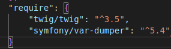

Toujours à la découverte du développement logiciel autour du langage PHP, je voulais m’intéresser cette fois à la gestion des services Web (API) et à la gestion des données. 

On trouve aujourd’hui de plus en plus de données partagées autour de projets « Open Data ». L’administration met par exemple de nombreuses données accessible à tous sur son site [Accueil - data.gouv.fr](https://www.data.gouv.fr/fr/).

Ces données sont directement accessibles en ligne et exploitables via l’appel d’API. Mais il reste une certaine complexité à les exploiter. Elles sont souvent stockées dans des formats spécifiques (JSON, XML) et l’accès au données nécessite de décoder les formats. 

Aussi est-il difficile de les exploiter directement, encore plus lorsque l’on souhaite croiser des données accessibles par des API différentes. 

Un autre point est que leur disponibilité dépend du site qui les héberge. 

Et que même si leur structure ne devrait pas ou peu changer, il n’est pas impossible qu’elle évolue ou que leur URL soit modifiée. 

Pour ces quelques raisons et pour l’exemple, j’ai décidé de réaliser un programme qui automatise la récupération des données pour l’injecter dans une base de données locales, ce qui me permettra de gérer leur disponibilité et une exploitation plus complexe. 

L’objectif sera la découverte de PHP sous le prisme de la récupération de données stockées dans un format XML sur un serveur distant pour les intégrer dans une base de données locale. 

Et de réaliser ce support afin de conserver une explication de mes développements et pouvoir y revenir plus facilement par la suite.  

J’en profiterai pour essayer d’appliquer les principes SOLID que j’ai abordé lors d’un cours en ligne récemment. 

**C’est quoi le but de suivre des principes de développement ? Et les principes SOLID ?** 

Amon sens, l’idée de mettre en place des principes de programmation a surtout pour but de rendre le code plus lisible et donc plus facilement maintenable, mais aussi plus facile à faire évoluer.

Les principes sont très clairement expliqués dans l’article de blog d’Alex

[SOLID en informatique : 5 principes (avec exemples) – Alex so yes](https://alexsoyes.com/solid/)

Et si on pouvait les résumer en un petit schéma très simple, voilà ce que cela raconte.

Mon fils étant passionné de formule 1, j’ai voulu monter un petit projet sur cette thématique et je me suis demandé s’il existait des API qui fournissent des données sur le sujet. 

Je suis tombé sur un site qui cumule l’ensemble des données depuis la création de ce sport.

[Formula One API (getpostman.com)](https://documenter.getpostman.com/view/11586746/SztEa7bL#intro)

Le site référence l’ensemble des informations relatives aux pilotes, constructeurs, circuits, saisons, résultats des courses, résultat des qualifications, calendrier, classements courses par courses pilote, classement course par course constructeur, arrêts aux stands, saison par saison, course par course, et même tour par tour, depuis le premier grand prix qui s’est déroulé en 1950.

Les données sont accessibles via cURL.

Ce qui permet de récupérer les données au format XML

Il ne reste plus qu’à écrire un petit programme qui va venir récupérer les fichiers XML, extraire les données et les stocker dans la base de données. 

Pour cela je partirai d’un projet vide, auquel j’ajouterai deux briques déjà existantes : le var-dumper de Symfony qui permet de visualiser des données de manière plus structurées (c’est plutôt cool, voir indispensable pour visualiser des objets complexes comme les objets XML) et le composant Twig pour les restitutions (je trouve la syntaxe du langage agréable).

Avant de commencer la partie extraction des données, je vais créer quelques outils pour la gestion de la base de données, des logs, de la récupération du fichier XML, un router (que j’ai piqué du cours Udemy à Lior, surtout pour comprendre le fonctionnement du Routing en dehors de Symfony, même si la brique n’est pas indispensable pour débuter le projet).

Ensuite je vais ajouter deux dossiers qui vont permettre de traiter le cœur du sujet, à savoir l’extraction des requête SQL qui me permettront de créer ma base de données, et l’import en fonction du niveau de données que je souhaite récupérer (si le format le permet). 

En fonction des données mises à disposition, je peux les récupérer à un niveau saison, course ou tour.

Je vais réaliser un extracteur différent pour chaque catégorie de données. 

La structure des fichiers mis à disposition pouvant différer d’une catégorie à l’autre, j’aurai un extracteur par catégorie qui aura les mêmes fonctions. 

Je vais pouvoir définir une interface qui sera implémentée par les extracteurs et qui demandera à chaque classe qui l’implémente de définir une fonction qui crée la table de base de données, une fonction qui supprime cette table, et une fonction qui extrait les requêtes alimentant la base de données. 

Au niveau de l’import je vais créer trois fonctions pour les trois possibilités d’import (par saison, course et tour).

Import qui prendra en entrée un extracteur. 

L’extracteur a deux fonctions, créer la nouvelle table et l’alimenter dans la base de données et éventuellement laisser des logs (utiles dans le cadre d’une backup du traitement et dans le cadre du debug pour comprendre l’origine d’une erreur en base de données).

Pour créer la base de données il ne reste plus qu’à appeler l’import de chaque catégorie. 

Une fois exécuté, les logs sont créés.

Et la base de données alimentée avec tout l’ historique de données formule 1 depuis 1950.

Ne restera plus qu’à proposer de l’affichage de ces données, éventuellement envisager de les croiser pour trouver des statistiques pertinentes :D 
